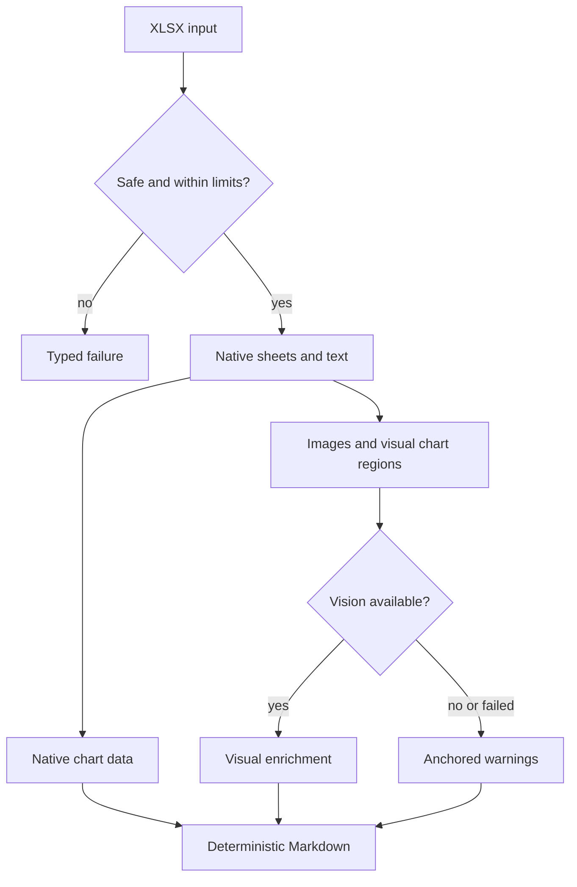
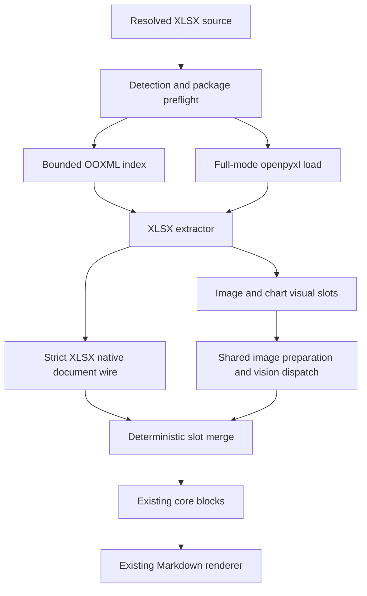
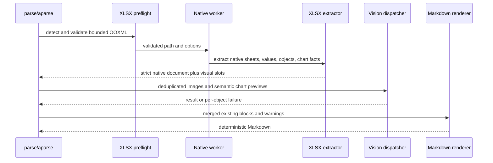
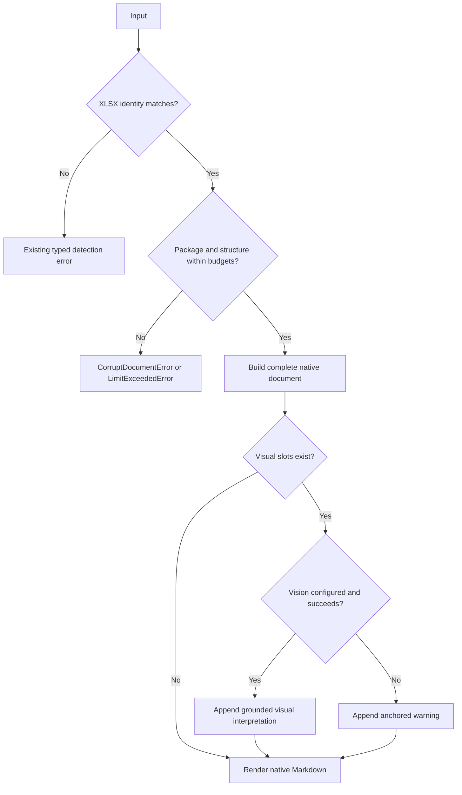
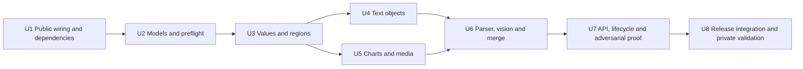

# XLSX 解析 - Plan

## Goal Capsule

- **Objective:** 为 OpenDocs v0.2.0 交付 XLSX 到 Markdown 的文本语义保真解析，并让视觉增强失败时仍可获得确定性的原生结果。
- **Authority order:** Product Contract 定义产品行为，Planning Contract 定义实现方式，Implementation Units 不得覆盖前两者。本计划仅在 XLSX 范围内取代 `docs/plans/2026-08-07-v0.2.0-release-plan.md` 的 A4 视觉禁用约束；v0.2.0 的其他工作仍由父计划管理。
- **Execution profile:** 代码实施，测试先行；先锁定容器、wire 和输出契约，再接入第三方解析与视觉增强。
- **Stop conditions:** 若实现需要新增公共返回类型、把工作表解释为页面、引入 Excel/LibreOffice 运行时，或无法在预检阶段约束峰值资源，则停止并回到计划评审。
- **Tail ownership:** 实施需完成公开测试、静态检查、构建和独立 wheel smoke；真实 XLSX 只进入忽略的私有探索流程。
- **Open blockers:** 无发布阻塞型规划问题。

---

## Product Contract

### Summary

OpenDocs 将从 path、bytes 和 binary stream 解析标准 XLSX 工作簿，并通过 `parse()` 与 `aparse()` 返回确定性的 Markdown。
原生解析是工作表、文本、显示值、合并关系和图表数值的事实来源，视觉模型只补充图片与图表的视觉含义。

### Problem Frame

OpenDocs 当前没有 XLSX 文档类型、检测、注册或解析能力，因此 Excel 工作簿仍是明确的不支持格式。
XLSX 不只是二维单元格集合：一份工作簿还可能包含多个可见或隐藏工作表、合并与稀疏区域、公式缓存、数字格式、批注、文本框、超链接、页眉页脚、图片、图表、外部关系和声明范围异常。
没有真实工作簿可以作为当前基线，因此本任务需要先用合成样本锁定公开行为，再以维护者提供的私有真实工作簿做发布前探索性验证。

### Risk Map

| 风险 | 可能造成的问题 | 契约响应 |
| --- | --- | --- |
| 公式缓存缺失或过期 | 输出为空或与重新计算结果不同 | 由 R5 和公式不重算边界约束 |
| 货币、日期和自定义格式 | 原始数值可读但用户看到的文本错误 | 由 R5-R6 约束 |
| 隐藏、空白和多工作表 | 内容被遗漏或顺序改变 | 由 R3 约束 |
| 合并单元格和相离区域 | 表格关系丢失或被错误拼接 | 由 R4 约束 |
| 稀疏但声明范围巨大的工作表 | 无界时间或内存消耗 | 由 R11-R12 约束 |
| 浮动图片、图表和文本框 | 内容脱离原始工作表位置 | 由 R4、R8-R10 约束 |
| 外部链接和数据关系 | 发生未授权网络访问或结果不可复现 | 由 R7 和 Scope Boundaries 约束 |
| 恶意或异常 OOXML 容器 | ZIP bomb、路径逃逸或不受控解压 | 由 R2、R11-R12 约束 |
| 厂商扩展和嵌入对象 | 静默遗漏或模型猜测内容 | 由 R14 约束 |

### Key Decisions

- **Markdown 语义保真。** (session-settled: user-directed — chosen over pixel-level fidelity or dual output: the SDK keeps its Markdown result contract and only text-bearing semantics are required.) Governs R1, R4-R7.
- **保存的显示值优先。** (session-settled: user-directed — chosen over always emitting formulas or attaching every formula: readable workbook text is the primary result.) Governs R5.
- **全部工作表进入结果。** (session-settled: user-directed — chosen over skipping hidden sheets or adding an inclusion option: sheet content must not disappear because of visibility state.) Governs R3.
- **全部标准文本对象属于核心内容。** (session-settled: user-directed — chosen over cell-only or content-only extraction: text outside cells is still document content.) Governs R7.
- **图表原生数据优先。** (session-settled: user-directed — chosen over vision-only or native-only chart handling: numeric accuracy and visual meaning are both useful, but native values remain authoritative.) Governs R8-R9.
- **视觉增强失败不阻断原生结果。** (session-settled: user-directed — chosen over failing the document or adding a strict mode: deterministic native content remains useful without a model.) Governs R9-R10.
- **可靠文本核心作为发布硬门。** (session-settled: user-directed — chosen over broad text completeness or full-sheet visual review: the first XLSX release needs a bounded contract without silently losing supported content.) Governs R1-R15.
- **真实工作簿是探索性验证。** (session-settled: user-directed — chosen over a mandatory release gate or post-release-only validation: real evidence should inform the release without making every rare gap blocking.) Governs R15.

<!-- ce-section: work-relationships -->
### How This Work Fits Together

本计划只负责 v0.2.0 的 XLSX 解析产品契约；下面是当前理解的相邻工作关系，不构成已承诺路线图。

- **XLSX 资源边界** — Shares 本计划的安全与有界处理要求；具体阈值在本任务的技术规划中确定。
  - **跨格式 `max_pages` 语义** — Can proceed independently of XLSX 内容解析；不得把工作表伪装成页面。
- **取消清理与对抗性 PDF 回归** — Can proceed independently of 本计划，仅共享 v0.2.0 发布门。
- **v0.2.0 发布准备** — Depends on 本计划完成公开文档、构建产物和独立安装 smoke 的 XLSX 覆盖。
- **Windows 探索性 smoke** — Can proceed independently of 本计划，且不是 XLSX 产品契约的一部分。

### Actors

- A1. SDK 使用者向 OpenDocs 提交 XLSX，并消费 Markdown 与 warning。
- A2. 视觉模型提供方在已配置且可用时补充图片和图表含义，不拥有原生数值的解释权。
- A3. 维护者在发布前审阅私有真实工作簿的探索性结果，并判断发现是否违反核心契约。

### Requirements

**格式识别与公共契约**

- R1. OpenDocs 必须从 path、bytes 和 binary stream 接受合法 XLSX，并让 `parse()` 与 `aparse()` 返回相同契约的确定性 Markdown。
- R2. OpenDocs 必须在无界处理前拒绝损坏、加密、伪装或超过资源边界的工作簿，并沿用现有类型化错误语义。

**工作簿结构与文本语义**

- R3. 输出必须按源顺序识别全部工作表，以稳定标题标明工作表名称及 Visible、Hidden 或 Very Hidden 状态，空工作表不得使其他工作表失败。
- R4. 每个工作表必须按行列顺序输出全部非空区域，保留合并跨度，并为区域与浮动对象提供稳定锚点；只有源工作簿提供表格语义时才能标记表头，不得仅凭首行位置猜测。
- R5. 单元格必须输出保存的显示文本及常见货币、百分比、日期时间、千分位和小数位语义；公式缓存缺失时输出公式文本，不支持的自定义格式输出可读值并产生 warning。
- R6. 解析器不得仅因样式存在而输出空单元格，也不得把字体、颜色、边框、尺寸或条件格式外观解释为必须还原的内容。
- R7. 标准批注、备注、文本框、图表文字、超链接文字与 URL、页眉和页脚必须进入结果；外部 URL 与数据关系只保留引用，不发起访问。

**图表与视觉内容**

- R8. 图表必须优先原生输出可确定获取的标题、分类、系列和数值，并保留其工作表位置。
- R9. 视觉模型已配置时，内嵌图片必须进入视觉解析，需要解释趋势、标注或含义的图表必须获得视觉补充，但视觉结果不得覆盖或改写原生文本和数值。
- R10. 视觉模型未配置、超时或失败时必须返回已完成的原生结果，并为每个未解析对象产生包含工作表和位置的 warning。

**安全、有界处理与确定性**

- R11. 解析必须限制工作表数量、声明维度、访问与非空单元格数量、合并区域数量、对象与媒体数量、媒体大小及总输出字符数。
- R12. 稀疏但声明范围巨大的工作表不得触发无界遍历，超限必须在昂贵解析或视觉调用前失败。
- R13. 相同工作簿在等价输入形式和同步、异步 API 下必须保持工作表顺序、内容顺序、warning 分类和失败类型一致。
- R14. 对无法可靠理解的厂商扩展、复杂绘图、SmartArt 或嵌入对象必须确定性跳过并产生可定位 warning，禁止静默丢失或猜测内容。

**验收证据**

- R15. 自动化发布门必须使用合成 XLSX 覆盖全部核心契约；私有真实工作簿作为发布前探索性验证，仅当发现违反 R1-R14 的核心缺陷时阻断发布，罕见结构和视觉增强缺口可以记录后发布。

### Key Flows



- F1. 正常解析
  - **Trigger:** A1 提交合法且未超限的 XLSX。
  - **Actors:** A1、A2。
  - **Steps:** 按 R1-R9 验证工作簿、提取全部工作表与原生内容、补充可用的视觉结果，并按源顺序合并。
  - **Outcome:** 返回确定性 Markdown 和必要 warning。
  - **Covers:** R1-R9、R11、R13。
- F2. 视觉能力不可用
  - **Trigger:** 工作簿包含图片或需要视觉补充的图表，但模型未配置、超时或失败。
  - **Actors:** A1、A2。
  - **Steps:** 保留原生结果并按 R10 标记每个未完成的视觉对象。
  - **Outcome:** 解析成功返回，调用方可以定位缺失的视觉补充。
  - **Covers:** R9-R10、R13-R14。
- F3. 非法或超限工作簿
  - **Trigger:** 输入损坏、加密、伪装或触发任一资源边界。
  - **Actors:** A1。
  - **Steps:** 在无界遍历和视觉调用前终止处理。
  - **Outcome:** 返回稳定的类型化错误，不返回误导性的部分成功结果。
  - **Covers:** R2、R11-R12。
- F4. 私有真实工作簿探索
  - **Trigger:** A3 在发布前提供并审阅一份真实 XLSX 及其 Markdown。
  - **Actors:** A3。
  - **Steps:** 判断发现是否违反核心要求，并将非核心缺口记录为后续候选。
  - **Outcome:** 核心缺陷阻断发布，罕见结构或视觉增强缺口不自动阻断。
  - **Covers:** R15。

### Acceptance Examples

- AE1. 全部工作表与状态
  - **Covers R3-R4.**
  - **Given:** 工作簿依次包含可见、Hidden、Very Hidden 和空工作表。
  - **When:** 通过任一受支持输入形式解析。
  - **Then:** Markdown 按相同顺序输出四个工作表标题并标注状态，空表不影响其他内容。
- AE2. 公式与显示格式
  - **Covers R5-R6.**
  - **Given:** 单元格包含货币、百分比、日期、带缓存的公式、无缓存公式和仅样式空单元格。
  - **When:** 解析工作表。
  - **Then:** 输出保存的可读文本，缺少缓存的公式降级为公式文本，仅样式空单元格不制造内容。
- AE3. 合并与相离区域
  - **Covers R4.**
  - **Given:** 工作表包含横向和纵向合并单元格，以及被全空行列分隔的多个非空区域。
  - **When:** 解析工作表。
  - **Then:** 合并跨度和所有非空内容均保留，各区域以确定的行列顺序出现并可定位。
- AE4. 工作表外围文本与链接
  - **Covers R7、R14.**
  - **Given:** 工作表包含批注、备注、文本框、图表标签、超链接和页眉页脚，并引用外部 URL。
  - **When:** 解析工作簿。
  - **Then:** 可支持的文本和 URL 进入结果，OpenDocs 不访问外部地址，无法支持的对象产生可定位 warning。
- AE5. 图表原生与视觉结果
  - **Covers R8-R10.**
  - **Given:** 图表具有标题、分类、系列、数值和可由视觉模型识别的趋势标注。
  - **When:** 原生与视觉解析均成功。
  - **Then:** 原生数据按源值输出，视觉结果只补充趋势与含义，并保留图表锚点。
- AE6. 视觉失败降级
  - **Covers R9-R10.**
  - **Given:** 工作簿包含图片和图表，但视觉模型不可用或调用失败。
  - **When:** 解析工作簿。
  - **Then:** 原生文本和图表数据正常返回，每个未解析视觉对象都有工作表与位置 warning。
- AE7. 对抗性和稀疏工作簿
  - **Covers R2、R11-R12.**
  - **Given:** 工作簿包含异常容器关系、超量媒体或极大的声明范围但只有少量非空单元格。
  - **When:** 解析工作簿。
  - **Then:** 在无界遍历或视觉调用前以稳定类型化错误终止。
- AE8. 等价 API 行为
  - **Covers R1、R13.**
  - **Given:** 同一合成 XLSX 以 path、bytes 和 binary stream 输入。
  - **When:** 分别调用 `parse()` 与 `aparse()`。
  - **Then:** Markdown、warning 分类和失败类型满足等价契约。
- AE9. 私有探索性验证
  - **Covers R15.**
  - **Given:** 维护者提供真实 XLSX，并人工对照源文件审阅结果。
  - **When:** 发现差异。
  - **Then:** 违反核心要求的差异阻断发布，罕见结构或视觉增强缺口被记录但不自动阻断。

### Success Criteria

- R1-R15 均有自动化合成样本或确定性检查覆盖，且现有支持格式没有输出顺序回归。
- 每一次内容降级都能由返回结果或 warning 观察，不能以“解析成功”掩盖静默丢失。
- 维护者可以只依赖本 Product Contract 判断一个真实工作簿发现属于核心缺陷还是非阻断增强缺口。

### Scope Boundaries

- 不还原字体、字号、颜色、背景、边框、列宽、行高、条件格式外观或像素级版式。
- 不访问外部 URL、链接工作簿、外部数据连接或远程资源。
- 不支持旧版 `.xls`、宏工作簿 `.xlsm`、二进制 `.xlsb` 或其他表格格式。
- 不重新计算公式，也不承诺缓存值反映工作簿最后保存之后的外部变化。
- 不把整张工作表的视觉解析设为默认结果或发布硬门。
- 不在本计划中改变结构化返回类型、依赖 extras、全局并发、CLI、Node.js SDK 或跨语言 schema。
- 不把跨格式 `max_pages`、DOCX 结构上限、取消清理、PDF 防护或 Windows 支持纳入 XLSX 主动范围。

### Dependencies and Assumptions

- 当前公共 API 的成功结果是 Markdown 字符串，XLSX 必须遵循相同契约。
- 当前 Office 安全层和视觉管线可以提供复用基础，但 XLSX 仍需自己的容器识别、关系约束和资源边界。
- 公式显示值来自工作簿保存的缓存，OpenDocs 不承担电子表格计算引擎职责。
- 视觉模型是可选增强依赖，任何视觉结论都不能成为原生数值的替代来源。
- 当前没有真实 XLSX 基线；维护者将在发布前提供私有工作簿做探索性审阅。

### Sources and Research

- `docs/plans/2026-08-07-v0.2.0-release-plan.md`：v0.2.0 总体边界、XLSX 候选范围与相邻工作。
- `docs/roadmap.md`：已发布能力和 v0.2.0 在路线图中的位置。
- `src/opendocs/api.py`：当前 Markdown 返回契约与同步、异步共享路径。
- `src/opendocs/parsers/office/package.py`：现有 Office 容器安全边界及 XLSX 需要扩展的基础。
- `src/opendocs/markdown.py`：合并单元格可使用现有跨度表格语义表达。
- `src/opendocs/parsers/office/parser.py` 与 `src/opendocs/parsers/office/pptx.py`：现有 Office 视觉合并和图表原生数据行为。

---

## Planning Contract

Product Contract unchanged.

### Key Technical Decisions

- KTD1. **使用独立 XLSX 解析域和混合读取路径。** 新增私有 `XlsxParser`、XLSX 文档模型和严格 wire；不把工作表塞入基于页面的 `OfficeDocument`。容器与补充对象由受限 OOXML 流式读取，单元格、合并和 Excel 表格由 `openpyxl` 完整模式读取。该方案复用公共 parser/runtime/vision 契约，但不扩大 DOCX/PPTX 的模型。Governs R1-R4, R7-R14. (session-settled: user-approved — chosen over extending the page-oriented OfficeParser or using only one parser: XLSX needs sheet semantics plus low-level coverage that neither alternative provides.)
- KTD2. **先预检，后加载工作簿。** `openpyxl.load_workbook()` 之前必须完成 ZIP 成员、关系、XML 安全、工作表、维度、单元格、合并、字符串、对象和媒体预算检查。XLSX 扩展现有 Office 包验证白名单，但不绕过已有 2,048 成员、32 MiB 声明总量、4 MiB 单 XML、256 个媒体、16 MiB 单媒体、24 MiB 媒体总量和 100:1 压缩比限制。直接 OOXML 解析显式使用 `defusedxml` 并拒绝 DTD/实体；ZIP bomb 仍由包级预算处理。Governs R2, R11-R12. (session-settled: user-approved — chosen over loader-first validation: malformed dimensions and XML can consume resources before a high-level library returns control.)
- KTD3. **固定依赖为 `openpyxl>=3.1.5,<3.2` 与 `defusedxml>=0.7.1,<1`。** 使用 `read_only=False`、`data_only=False`、`rich_text=False`、`keep_links=False`。公式工作簿只加载一次；直接 OOXML sidecar 同时保留 `<f>` 和保存的 `<v>` 缓存，避免第二次完整加载。禁止依赖 `openpyxl` 私有 `_charts` 或 `_images` 作为核心事实来源。Governs R2, R5, R7-R9, R11. (session-settled: user-approved — chosen over read-only loading or dependency-free OOXML reimplementation: read-only omits required objects, while a full spreadsheet reader is beyond v0.2.0.)
- KTD4. **“保存的显示文本”采用有界格式子集。** 原生事实是保存的标量或公式缓存，解析器只对 `General`、布尔/错误值、整数、定点小数、千分位、百分比、常用直接货币符号、日期、时间、日期时间和 elapsed-time 执行确定性格式化，并尊重 1900/1904 日期系统。颜色、填充、条件段、会计占位、科学计数、分数和复杂本地化自定义格式不进入 v0.2.0 保真承诺；它们输出稳定原始值并产生 `xlsx_unsupported_number_format`。Governs R5-R6.
- KTD5. **公式缓存优先，缺失时回退公式。** 缓存节点存在时按 KTD4 输出；节点不存在时输出公式文本并产生 `xlsx_formula_cache_missing`。解析器不计算公式、不判断缓存是否过期，也不访问外部工作簿。Governs R5, R7.
- KTD6. **按语义坐标生成区域和对象槽位。** Excel 原生表格范围先占位，且只有它设置 `header_rows=1`。其余非空语义单元格与合并矩形按上下左右连通分量拆分，按左上角、右下角排序；无跨度使用 `TableBlock(header_rows=0)`，有跨度使用 `SpannedTableBlock`。每个 sheet、区域和浮动对象使用仅含工作表序号、A1 范围和对象序号的受控 Markdown 注释锚点，禁止把用户文本写入注释。Governs R3-R4, R13.
- KTD7. **所有 sheet-like 条目按工作簿关系顺序处理。** `workbook.xml` 与关系文件是 worksheet、chartsheet、名称、状态和目标 part 的权威来源；不依赖 `wb.worksheets` 推断全量顺序。空 sheet 仍输出标题。页眉页脚使用 odd/even/first、header/footer、left/center/right 的固定次序；普通对象按 `(row, column, kind_rank, source_ordinal)` 插入。Governs R3-R4, R7-R8, R13.
- KTD8. **文本对象走低层 OOXML 补充读取。** 经典 comments/notes、threaded comments 与 person 映射、DrawingML 文本框、图表标题/轴/数据标签、超链接显示文本与目标、页眉页脚均进入原生槽位。SmartArt、OLE、控件、VML 绘图文本和厂商扩展无法可靠读取时，按每个对象产生 `xlsx_unsupported_object`。URL 只允许安全转义后的 `http`、`https`、`mailto` 和工作簿内锚点形成链接；其他 scheme 与外部工作簿引用保留为纯文本并 warning，绝不访问。Governs R7, R14.
- KTD9. **图表视觉使用原生事实生成的语义预览。** ChartML 直接提取标题、轴/标签文本、系列名、分类、X/Y/数值、缓存和锚点；简单本地引用可从已提取单元格解析，外部或不支持引用保留文字并 warning。使用 Pillow 把这些权威事实渲染成规范化语义卡片，再让视觉模型补充趋势、关系和含义。该结果必须标记为视觉解释，不宣称还原 Excel 图表外观。Governs R8-R9. (session-settled: user-approved — chosen over Excel/LibreOffice pixel rendering or native-only chart output: external rendering adds a cross-platform runtime, while native-only output cannot provide the approved visual interpretation.)
- KTD10. **图片复用原始媒体，视觉按内容去重、按出现位置回放。** 图片使用包内原始 bytes、锚点和 alt text，并复用现有图片安全准备逻辑。同一 SHA-256 只调用一次模型，但结果或失败 warning 必须回放到每个出现位置。图表语义预览采用相同调度模型。Governs R9-R10, R13.
- KTD11. **XLSX 视觉错误采用 fail-open。** 模型未配置、认证/权限错误、无效请求、单对象超时、提供方失败和模型输出无效都返回原生结果，并按对象产生 `xlsx_vision_unavailable`、`xlsx_vision_timeout` 或 `xlsx_vision_failed`。只有调用方取消和整份文档超时沿用公共 API 的中断语义。Governs R9-R10, R13. (session-settled: user-approved — chosen over inheriting every Office fatal-vision branch: the Product Contract requires useful native output for all visual-provider failures.)
- KTD12. **资源限制保持私有，不改变 `ParseOptions`。** `max_pages` 对 XLSX 无效，且不得限制工作表。v0.2.0 使用下面的内部常量；资源特征测试只能在不突破包预算和 wire 预算的前提下收紧它们。Governs R1-R2, R11-R13. (session-settled: user-approved — chosen over adding public spreadsheet options or mapping sheets to pages: the release should preserve the public API and correct semantics.)

### Resource Budget

| 资源 | v0.2.0 上限 | 执行点 | 超限结果 |
| --- | ---: | --- | --- |
| Sheet-like 条目 | 128 | `workbook.xml` 预检 | `LimitExceededError` |
| 单表声明矩形 | 2,000,000 个坐标 | worksheet dimension 与实际坐标预检 | `LimitExceededError` |
| 全工作簿序列化 `<c>` | 200,000 | worksheet XML 流式计数 | `LimitExceededError` |
| 非空语义单元格 | 50,000 | 类型与值解码时 | `LimitExceededError` |
| 最终物化网格坐标 | 200,000 | 区域、表格与合并布局前 | `LimitExceededError` |
| 合并范围 | 10,000 个且总 footprint 50,000 | mergeCells 预检 | `LimitExceededError` |
| Shared strings | 100,000 项且解码文本 1,000,000 字符 | sharedStrings 流式读取 | `LimitExceededError` |
| Excel 表格 | 1,024 个且总 footprint 200,000 | table part 预检 | `LimitExceededError` |
| 超链接与批注 | 合计 20,000 个 | 关系和 comments 预检 | `LimitExceededError` |
| 浮动绘图、图表、图片、文本框 | 合计 256 个 | drawing/chart 关系预检 | `LimitExceededError` |
| 图表缓存点 | 200,000 个 | ChartML 预检 | `LimitExceededError` |
| 原生解码文本 | 1,000,000 字符 | block 构建前累计 | `LimitExceededError` |
| Native worker inline / frame | 沿用 8 MiB / 12 MiB | 严格 wire 编解码 | 现有协议错误映射 |
| 最终 Markdown | 沿用 `max_output_chars`，默认 400,000 | 公共 renderer | 现有截断 warning |

不支持格式类 warning 每个 code 保留前 20 条并附确定性汇总；视觉对象与无法支持的浮动对象因总量已受 256 限制，必须逐个保留可定位 warning。

### Warning and Failure Taxonomy

| 场景 | 结果 |
| --- | --- |
| ZIP 损坏、必需 part/关系缺失、DTD/实体、非法 XML | `CorruptDocumentError` |
| 加密 ZIP 成员或 Office 加密容器 | 沿用检测层的类型化拒绝；进入 XLSX 包层后映射为 `CorruptDocumentError` |
| 任一包、结构、对象、字符或 wire 预算超限 | `LimitExceededError` |
| 公式无缓存 | 公式文本 + `xlsx_formula_cache_missing` |
| 数字格式超出 KTD4 | 稳定原始值 + `xlsx_unsupported_number_format` |
| 外部引用、危险 URL scheme 或无法解析的本地引用 | 纯文本引用 + `xlsx_external_reference` |
| 不支持的标准/厂商对象 | 跳过该对象 + `xlsx_unsupported_object` |
| 视觉未配置、超时或失败 | 原生结果 + KTD11 对应 warning |

### High-Level Technical Design

#### Component and Data Flow



OOXML index 负责信任边界、sheet 关系、公式缓存和不支持对象发现。`openpyxl` 只在包已证明有界后负责受支持的工作簿值对象。XLSX merge layer 只输出现有 core blocks 和受控 Markdown anchors。

#### Parse Sequence



预检发生在第三方工作簿加载之前。视觉调用发生在全部原生事实已经成功提取之后，因此 KTD11 的 fail-open 不会产生部分原生文档。

#### Decision and Failure Flow



### Output Structure

```text
src/opendocs/parsers/xlsx/
├── __init__.py
├── extract.py
├── merge.py
├── models.py
├── parser.py
├── preflight.py
└── values.py
```

共享图片准备若需要抽取，只新增一个中立的私有 helper，例如 `src/opendocs/parsers/embedded_vision.py`。不得借 XLSX 引入 DOCX/PPTX 模型重构。

### System-Wide Impact

| 表面 | 影响 | 约束 |
| --- | --- | --- |
| 公共 API | 新增可识别格式，不改签名与返回类型 | `parse()`/`aparse()`、输入形态和 warning 对等 |
| Detection / registry | 新增 `DocumentType.XLSX`、ZIP 身份和默认 parser | 扩展名不可信；容器身份优先 |
| Native runtime | 新增 XLSX 严格 wire 与 worker 路径 | 8 MiB inline、12 MiB frame 和取消清理不放宽 |
| Markdown | 复用 Heading、Table、SpannedTable、Paragraph、InlineLink、MarkdownBlock | 不新增公开 XLSX Markdown 方言 |
| Vision | 新增图片与语义图表预览请求 | 原生事实优先；按 digest 去重、按位置回放 |
| Packaging | 增加两个直接运行依赖 | wheel metadata、锁文件和隔离安装必须一致 |
| Release evidence | 增加公开合成门与私有真实工作簿协议 | 私有文件、输出和检查表不得提交 |

### Sequencing



每个 feature-bearing unit 先增加失败测试，再修改生产代码。U1-U2 固定输入、错误和 wire 边界；U3-U5 构建原生事实；U6 才接视觉；U7-U8 完成跨层与发布证据。

### Alternative Approaches Considered

- **纯 `openpyxl`。** 拒绝，因为 read-only 模式缺失图表、图片和批注，完整模式也不覆盖 threaded comments、DrawingML 文本框和所有图表关系；私有对象字段不能承担稳定核心契约。
- **纯手写 OOXML。** 拒绝，因为 v0.2.0 不应重写 Excel 单元格类型、样式索引、日期系统、表格和合并兼容层；低层解析只负责安全预检和高层库缺失的对象。
- **调用 Excel 或 LibreOffice 渲染原图。** 拒绝，因为它扩大跨平台运行时、沙箱、进程清理和发布体积；KTD9 已用有界语义预览满足趋势补充。
- **整张工作表视觉解析。** 拒绝，因为成本、确定性和大表资源风险与原生数据优先相冲突。
- **只做单元格文本，不做外围对象。** 拒绝，因为它违反 R7，并会把正文之外的标准文本静默丢失。

### Risks and Mitigations

| 风险 | 缓解 | 验证证据 |
| --- | --- | --- |
| `openpyxl` 完整模式内存放大 | loader 前执行 KTD2 与 Resource Budget；worker wire 保持既有上限 | 对抗性结构测试与 U7 资源特征测试 |
| Excel 显示格式复杂且本地化 | KTD4 固定硬支持子集；其余可读降级并 warning | 精确字符串断言覆盖货币、百分比、日期和负值 |
| 公式缓存不存在或过期 | 保留缓存节点存在性；缺失回退公式；不宣称新鲜度 | 直接 patch OOXML 的缓存有/无/空值测试 |
| 图表 API 与厂商扩展不稳定 | ChartML 作为事实来源；私有 `openpyxl` 字段仅可作非契约辅助 | 原生图表 fixture 与未知扩展 warning |
| 图表语义预览被误读为原图 | 输出明确标为视觉解释，模型 prompt 禁止改写原生值 | mock vision 断言 prompt、锚点与合并优先级 |
| URL 或外部关系触发访问 | `keep_links=False`，直接关系只保留文本，危险 scheme 不形成链接 | 网络调用禁用测试和链接转义测试 |
| warning 风暴掩盖输出 | 非对象 warning 有界聚合；对象总数先硬限 | 超量格式与 256 对象边界测试 |
| 无真实工作簿导致合成盲区 | 公开合成门覆盖契约；发布前维护者提供私有 XLSX 做探索 | U8 私有审阅清单，不生成可提交 baseline |

### Dependencies and Prerequisites

- `openpyxl` 与 `defusedxml` 进入直接 runtime dependencies 和 `uv.lock`；不新增 extra。
- Pillow、native worker、Markdown renderer、warning 发射与 vision dispatcher 沿用现有依赖和生命周期。
- 真实 XLSX 在实施完成后由维护者提供；缺少该文件不阻止公开合成开发，但阻止把真实兼容性写成已验证事实。

### Sources and Research

- [`openpyxl` PyPI](https://pypi.org/project/openpyxl/)：当前稳定版 3.1.5、Python 版本要求和官方 XML 安全提示。
- [`openpyxl` tutorial](https://openpyxl.readthedocs.io/en/stable/tutorial.html)：`data_only`、`read_only`、`rich_text`、`keep_links` 行为，以及 shapes 和 read-only 特性缺口。
- [`openpyxl` optimized modes](https://openpyxl.readthedocs.io/en/stable/optimized.html)：read-only 对声明维度的依赖和显式 close 责任。
- [`openpyxl` comments](https://openpyxl.readthedocs.io/en/3.0/comments.html)：经典批注仅保留文本/作者、格式与容器信息丢失，read-only 不支持批注。
- [`defusedxml` PyPI](https://pypi.org/project/defusedxml/)：XML entity/DTD/DoS 防护范围；它不替代 ZIP bomb 预算。
- `src/opendocs/parsers/office/package.py`：现有 OOXML 包预算、关系和路径验证模式。
- `src/opendocs/parsers/office/models.py`、`src/opendocs/parsers/office/parser.py`、`src/opendocs/parsers/office/merge.py`：严格 worker wire、视觉去重和按出现位置合并模式。
- `src/opendocs/parsers/office/pptx.py`：原生图表标题、分类、系列和值的相邻实现模式。
- `src/opendocs/markdown.py`、`tests/test_markdown.py`：合并跨度与受控 Markdown 注释的渲染模式。
- AGENTS.md 指定的本地 `43x-agent` checkout 中，Office parser 仅作为行为参考；OpenDocs 必须独立实现，且不得复制私有文件、模型载荷或应用依赖。

---

## Implementation Units

### U1. Public XLSX Identity, Dependencies, and Registration

- **Goal:** 让合法 XLSX 进入现有公共解析主路径，并在第三方加载前复用 OOXML 包安全边界。
- **Requirements:** R1-R2, R11-R13；KTD2-KTD3、KTD12；Covers F3 / AE7-AE8.
- **Dependencies:** 无。
- **Files:** `pyproject.toml`, `uv.lock`, `src/opendocs/_models.py`, `src/opendocs/detection.py`, `src/opendocs/parsers/registry.py`, `src/opendocs/parsers/office/package.py`, `tests/test_models.py`, `tests/test_detection.py`, `tests/test_registry.py`, `tests/test_office_package.py`, `tests/xlsx_fixtures.py`.
- **Approach:**
  1. 先以合成 ZIP fixture 锁定 `.xlsx`、无名 bytes/stream、后缀不匹配、缺失 workbook part、重复/加密成员和关系逃逸行为。
  2. 新增 `DocumentType.XLSX`，以 `[Content_Types].xml`、根 relationship 和 `xl/workbook.xml` 共同确认身份。
  3. 扩展 Office package validator 的 XLSX required parts 与允许关系根，不改变 DOCX/PPTX 预算和错误行为。
  4. 加入 KTD3 依赖与默认 registry；parser 在 U6 前可用明确的未完成测试替身，不合入不能解析的默认注册状态。
- **Execution note:** 从失败的 detection、package 和 registry 契约测试开始；该 unit 必须以完整可调用的最小 parser seam 收尾，避免中间提交破坏默认 registry。
- **Patterns to follow:** `src/opendocs/detection.py` 的容器身份匹配，`src/opendocs/parsers/office/package.py` 的路径/关系验证，`src/opendocs/parsers/registry.py` 的默认注册。
- **Test scenarios:**
  1. `.xlsx` path、无扩展 bytes、命名与无名 binary stream 包含合法 workbook 关系时都识别为 XLSX。
  2. `.xlsx` 实际为 DOCX/PPTX、ZIP 缺少 `xl/workbook.xml`、content type 或根关系不匹配时返回现有类型化 mismatch/corrupt 语义。
  3. XLSX 包含路径穿越、重复成员、加密 flag、悬空关系、外部 required root relationship、超限成员或压缩比时，在 parser 调用前失败。
  4. DOCX/PPTX 的 required part 和包预算回归测试保持不变。
  5. 构建默认 registry 时 XLSX 与现有格式各注册一次，缺少 runtime 的错误契约不变。
- **Verification:** 所有合法输入到达 XLSX parser seam；所有伪装、损坏与包超限输入在第三方加载前以稳定类型失败；现有 Office 格式无注册或验证回归。

### U2. XLSX Wire Models and Structural Preflight

- **Goal:** 建立不使用 page 语义的严格 XLSX native document，并在 `openpyxl` 前执行完整结构预算。
- **Requirements:** R2-R4, R7-R8, R11-R14；KTD1-KTD2、KTD7、KTD12；Covers F3 / AE1、AE7.
- **Dependencies:** U1.
- **Files:** `src/opendocs/parsers/xlsx/__init__.py`, `src/opendocs/parsers/xlsx/models.py`, `src/opendocs/parsers/xlsx/preflight.py`, `tests/test_xlsx_models.py`, `tests/test_xlsx_preflight.py`, `tests/xlsx_fixtures.py`, `tests/test_runtime.py`.
- **Approach:**
  1. 定义不可变 `XlsxDocument`、`XlsxSheet`、原生槽位、图片/图表视觉槽位、数字 sheet index 和 A1 anchor；wire 只接受已知字段、tuple、受限 basename、SHA-256 和现有 Block。
  2. 用 `defusedxml` 流式建立 OOXML index，解析 workbook/sheet/chartsheet 顺序、状态、part 目标、日期系统、shared strings、worksheet 元数据、drawing/chart/comment/table 关系。
  3. 在返回 index 前执行 Resource Budget；维度、实际 cell 坐标、merge/table footprint、对象和字符计数都必须交叉验证。
  4. 把恶意 XML、非法命名空间/关系和超限分别映射到 Planning Contract 的失败分类。
- **Execution note:** 在引入完整工作簿加载前用 ZIP/XML patch fixture 穷举失败面；不要创建或提交二进制样本。
- **Patterns to follow:** `src/opendocs/parsers/office/models.py` 的 dataclass/wire 校验，`src/opendocs/_native_protocol.py` 的 frame 预算，`src/opendocs/parsers/office/package.py` 的安全路径。
- **Test scenarios:**
  1. worksheet、chartsheet、hidden、veryHidden 和空 sheet 按 relationship 顺序进入严格 wire，重复 source index、非法 anchor 或未知字段被拒绝。
  2. 128 个 sheet 成功，129 个失败；声明矩形、序列化 cell、非空 cell、materialized grid、merge、shared string、table、object、chart cache 和文本预算逐项验证边界值与超一值。
  3. 声明 `A1:XFD1048576` 但只有一个 cell 的稀疏表在 `openpyxl` 前失败，不触发矩形遍历。
  4. DTD、内部/外部实体、畸形 XML、Zip Slip、悬空 drawing/chart/comment 关系返回 `CorruptDocumentError`。
  5. 编码后的最大合法 wire 小于 12 MiB；超出 inline/container/frame 预算时沿用现有 runtime 失败映射。
- **Verification:** 任一第三方加载都只接收已通过预检的包；XLSX wire 不含 page 概念，且所有可放大结构有明确边界测试。

### U3. Saved Values, Sheets, Tables, Regions, and Merges

- **Goal:** 输出全部 sheet 的稳定原生网格内容，并准确处理常见显示格式、公式缓存、表格和合并跨度。
- **Requirements:** R3-R6, R11-R13；KTD3-KTD7、KTD12；Covers F1 / AE1-AE3.
- **Dependencies:** U2.
- **Files:** `src/opendocs/parsers/xlsx/values.py`, `src/opendocs/parsers/xlsx/extract.py`, `tests/test_xlsx_values.py`, `tests/test_xlsx_extract.py`, `tests/xlsx_fixtures.py`.
- **Approach:**
  1. 以 full-mode `openpyxl` 读取已预检 workbook，并由 OOXML formula/cache sidecar 覆盖公式显示选择。
  2. 在 `values.py` 集中实现 KTD4-KTD5；格式 warning 按 code 和 sheet/coordinate 稳定聚合。
  3. 先占用 Excel table 精确范围，再对剩余语义单元格和 merge footprint 做连通分量；物化 component bounding box 前再次扣减 grid 预算。
  4. 空 sheet 只产生标题与 sheet anchor；style-only 空 cell 计入安全访问但不成为语义坐标。
  5. 将无 merge 区域转换为 `TableBlock(header_rows=0)`，有 merge 区域转换为 `SpannedTableBlock`，并按 KTD6 排序。
- **Execution note:** 公式 fixture 必须直接 patch worksheet XML 的 `<f>`/`<v>`，不能假装 `openpyxl` 会计算公式。
- **Patterns to follow:** `src/opendocs/parsers/office/pptx.py` 和 `src/opendocs/parsers/office/docx.py` 的 table block 构造，`src/opendocs/markdown.py` 的 span 渲染。
- **Test scenarios:**
  1. Covers AE1. visible、hidden、veryHidden、空 worksheet 和 chartsheet 按源顺序输出固定标题、状态和安全 anchor。
  2. Covers AE2. `$1,234.50`、`¥1,234`、`12.50%`、千分位、负数、1900/1904 日期、时间和 elapsed-time 产生精确稳定文本。
  3. 带缓存公式输出格式化缓存；缓存缺失输出公式并 warning；缓存节点存在但值为空与真正缺失可区分；外部公式不发起访问。
  4. scientific、fraction、accounting、条件/颜色段和复杂本地化格式输出稳定原始值并按坐标 warning；同 code 超过 20 条时保留确定性汇总。
  5. Covers AE3. 横向/纵向合并、Excel table、无表头普通区域、多个相离区域和内部空 cell 保留全部非空内容与跨度，且顺序可重复。
  6. 仅字体/颜色/边框/条件格式的空 cell 不产生 Markdown 内容；全空工作簿仍成功输出所有 sheet 标题。
  7. component bounding box、table 或 merge footprint 在预检后因组合超预算时，在物化前返回 `LimitExceededError`。
- **Verification:** 合成工作簿的 sheet、值、公式、格式、区域和 merge Markdown 与黄金字符串一致；重复解析及输入形态不改变顺序。

### U4. Comments, Text Boxes, Links, and Headers or Footers

- **Goal:** 把单元格之外的标准文本对象纳入原生结果，并对外部关系和不支持对象提供可定位降级。
- **Requirements:** R4, R7, R11, R13-R14；KTD7-KTD8、KTD12；Covers F1 / AE4.
- **Dependencies:** U3.
- **Files:** `src/opendocs/parsers/xlsx/extract.py`, `src/opendocs/parsers/xlsx/models.py`, `tests/test_xlsx_extract.py`, `tests/test_xlsx_models.py`, `tests/xlsx_fixtures.py`.
- **Approach:**
  1. 从 OOXML index 读取 classic comments/notes、threaded comments/person、`xdr:sp/a:txBody` 文本框和 shape alt text，不依赖 `openpyxl` 的有限 comment/drawing 映射。
  2. 单元格 hyperlink 用 `InlineLink` 表达安全目标；内部 anchor、外部 URL、外部 workbook 和危险 scheme 按 KTD8 分类。
  3. 解析页眉页脚文本并去除字体/颜色控制码；页码、日期、时间、文件名和 sheet 名字段保留为命名占位符，图片字段 warning。
  4. 生成对象槽位并按 KTD7 与 cell regions 合并；SmartArt、OLE、controls、VML 文本和 vendor extensions 逐对象 warning。
- **Patterns to follow:** `src/opendocs/parsers/office/docx.py` 的 `InlineLink` 与关系处理，`src/opendocs/parsers/office/models.py` 的 source index 和 warning 模型。
- **Test scenarios:**
  1. Covers AE4. 经典批注文本/作者、threaded comment/person、DrawingML 文本框、alt text 和页眉页脚都在正确 sheet/anchor 下出现。
  2. safe HTTP/HTTPS/mailto 与工作簿内链接转义为 Markdown 链接；`javascript:`、`file:`、相对外部工作簿和远程数据关系只输出文本并 warning。
  3. 测试期间禁止网络调用，包含外部 URL、externalLinks、data connections 的 workbook 仍零访问完成解析。
  4. odd/even/first × header/footer × left/center/right 按固定顺序输出；格式控制码不泄漏，动态字段使用稳定占位符。
  5. SmartArt、OLE、ActiveX/control、VML-only textbox 和未知 extension 各产生包含 sheet index、A1 anchor 或 object ordinal 的 warning。
  6. 20,000 个 comment/hyperlink 在边界成功，超一值在对象解码前失败；原生文本预算仍限制总内容。
- **Verification:** 所有承诺的非 cell 文本均可定位；任何外部引用无 I/O；不支持对象不会静默消失。

### U5. Native Chart Facts, Embedded Images, and Semantic Previews

- **Goal:** 以原生 ChartML 和媒体为事实来源，构建可去重的图片与图表视觉任务。
- **Requirements:** R4, R8-R10, R11, R13-R14；KTD8-KTD10、KTD12；Covers F1-F2 / AE5-AE6.
- **Dependencies:** U2-U4.
- **Files:** `src/opendocs/parsers/xlsx/extract.py`, `src/opendocs/parsers/xlsx/models.py`, `src/opendocs/parsers/xlsx/parser.py`, `src/opendocs/parsers/embedded_vision.py`, `tests/test_xlsx_extract.py`, `tests/test_xlsx_parser.py`, `tests/test_office_parser.py`, `tests/xlsx_fixtures.py`.
- **Approach:**
  1. 从 drawing anchors 和 ChartML 提取 chart title、axis/data-label text、series names、categories、X/Y/values、cache、local formulas、alt text 和位置。
  2. 解析已在 workbook 内的简单引用；外部、动态或不支持公式保留引用文本并产生 `xlsx_external_reference`，不得调用计算引擎或网络。
  3. 把原生图表事实输出为标题与无表头数据 block，再用 Pillow 生成无样式保真承诺的语义卡片；视觉 prompt 只允许补充趋势、关系、标注和含义。
  4. 提取原始图片 part、anchor 和 alt text，复用现有安全解码、尺寸、像素和 tile 预算。若抽取共享 helper，保持 Office 现有结果与 warning 不变。
  5. 以内容 digest 构建 visual slot；相同图片或语义卡片只准备一次。
- **Execution note:** 先锁定 native-only 图表与图片槽位，再加入语义卡片；视觉测试只使用 fake client，不调用真实模型。
- **Patterns to follow:** `src/opendocs/parsers/office/pptx.py` 的原生图表 block，`src/opendocs/parsers/office/parser.py` 的 digest 去重，`src/opendocs/vision/images.py` 的图片防护。
- **Test scenarios:**
  1. Covers AE5. line、bar、pie/doughnut 和 scatter 合成图表的标题、系列、分类、X/Y/值及 anchor 由 ChartML 稳定输出，视觉文本不能覆盖原生表。
  2. chart cache、简单本地 range、缺少 cache、动态 named formula 和 external reference 按 KTD9 解析或 warning，无网络和公式计算。
  3. 语义预览只包含原生事实与明确“视觉解释”标签；fake vision 返回趋势时结果位于对应 chart anchor 后。
  4. 同一媒体在多个 sheet/anchor 出现时只产生一次 vision request，但结果或失败状态可回放到全部位置。
  5. 图片格式伪装、解压 bomb、超尺寸、超像素、超 tile 和损坏媒体沿用图片安全错误或 warning，不扩大既有预算。
  6. 256 个浮动对象在边界成功，257 个失败；200,000 个 chart cache point 在边界成功，超一值在 preview 前失败。
  7. Office parser 回归测试证明共享 helper 抽取不改变 DOCX/PPTX request、结果顺序和 warning。
- **Verification:** 原生图表事实可独立构成完整 native-only 输出；视觉任务均有受控输入、digest 和出现位置；不需要 Excel/LibreOffice。

### U6. Parser Orchestration, Fail-Open Vision, and Deterministic Merge

- **Goal:** 把 native worker、视觉调度、warning 和 Markdown 合并成完整 `XlsxParser`，同时保持取消、超时和清理语义。
- **Requirements:** R1, R3-R4, R8-R10, R13-R14；KTD1、KTD6-KTD12；Covers F1-F2 / AE5-AE6、AE8.
- **Dependencies:** U3-U5.
- **Files:** `src/opendocs/parsers/xlsx/parser.py`, `src/opendocs/parsers/xlsx/merge.py`, `src/opendocs/parsers/xlsx/models.py`, `src/opendocs/parsers/registry.py`, `tests/test_xlsx_parser.py`, `tests/test_xlsx_merge.py`, `tests/test_registry.py`.
- **Approach:**
  1. 在 native worker 中执行 KTD2-KTD8 的完整原生提取并返回 strict wire；主进程只处理受限视觉 artifact 和 block merge。
  2. 以 digest 去重请求并按 source ordinal 排序；把每个 request 的 outcome 回放到 occurrence 集合。
  3. 单独实现 KTD11 的 XLSX fail-open 分类；不修改 Office parser 对现有格式的异常策略。
  4. `merge.py` 先输出 sheet heading/anchor，再按 KTD6-KTD7 排序原生和视觉槽位；原生 block 永远在同一对象的视觉解释之前。
  5. 只有 native extraction 不完整、调用方取消或文档 deadline 才中断成功路径；模型失败不得制造 `NoUsableContentError`。
- **Execution note:** 用 fake runtime/vision 先锁定异常矩阵，再接真实 native worker；同步超时和异步取消必须使用现有工作区生命周期。
- **Patterns to follow:** `src/opendocs/parsers/office/parser.py` 的 worker/vision 编排，`src/opendocs/parsers/office/merge.py` 的 occurrence 回放和 warning，`src/opendocs/api.py` 的 deadline/cancellation。
- **Test scenarios:**
  1. 无视觉对象、视觉未配置、全部视觉成功、部分成功和全部失败都返回相同原生 Markdown 主干。
  2. Covers AE6. 未配置、认证、权限、无效请求、provider error、坏模型输出和单 request timeout 按对象产生 KTD11 warning，且不抛出文档失败。
  3. 调用方 async cancellation 及时传播；sync document timeout 返回现有超时错误；两者不被 fail-open 捕获。
  4. 重复 digest 只调用一次，结果与 warning 按每个 sheet/anchor occurrence 回放，顺序不受 future 完成顺序影响。
  5. 原生 chart/table 与视觉解释同 anchor 时原生先出现；视觉不得删除、替换或重排原生 block。
  6. 全空 workbook 仍有 sheet heading，只有无法支持对象的 workbook 返回 headings 与 warnings，而不是空成功或模型猜测。
  7. XLSX registry 使用完整 parser；DOCX/PPTX/Image/PDF 视觉异常行为不受 KTD11 影响。
- **Verification:** `XlsxParser` 在所有视觉状态下满足原生优先和确定顺序；用户取消、文档超时和 parser 失败边界清晰且无资源泄漏。

### U7. Public API Parity, Resource Characterization, and Adversarial Regression

- **Goal:** 从公共 API 证明输入、同步/异步、warning、失败、资源和生命周期契约，并保护所有现有格式。
- **Requirements:** R1-R2, R10-R15；KTD2、KTD11-KTD12；Covers F1-F3 / AE7-AE8.
- **Dependencies:** U6.
- **Files:** `tests/test_api_xlsx.py`, `tests/test_xlsx_preflight.py`, `tests/test_xlsx_parser.py`, `tests/test_api.py`, `tests/test_api_m2.py`, `tests/test_runtime.py`, `tests/test_markdown.py`, `tests/xlsx_fixtures.py`.
- **Approach:**
  1. 用同一合成工作簿参数化 path、bytes、named/unnamed binary stream 和 `parse()`/`aparse()`，对比 Markdown、warning code/顺序和错误类型。
  2. 覆盖 repeated parse、`max_output_chars`、`max_pages=1`、vision 配置和输入后缀组合；明确 `max_pages` 不减少 sheet。
  3. 对 Resource Budget 每项执行边界/超一测试，并验证失败发生在 `openpyxl` load、grid materialization 或 vision 前。
  4. 用受控 worker fixture 验证正常、异常、async cancellation、sync timeout 和 hard termination 后 workspace/artifact 清理。
  5. 运行现有全格式回归，确认新增 DocumentType、共享 helper 和 renderer 使用不改变旧输出。
- **Execution note:** 先写公共集成失败测试，再补资源特征；不要把环境相关峰值 RSS 写成未经证实的发布承诺。
- **Patterns to follow:** `tests/test_api_m2.py` 的 path/bytes/stream 对等，`tests/test_runtime.py` 的 worker 边界，现有 parser cancellation/cleanup 测试。
- **Test scenarios:**
  1. Covers AE8. 六组输入/API 组合的 Markdown 字符串完全一致，warning code 与失败类型对等；warning 的 Python 发射位置保持公共契约。
  2. 同一 workbook 连续解析至少三次，sheet、region、object 和 warning 顺序完全一致。
  3. `max_pages=1` 的多 sheet workbook 仍输出全部 sheet；`max_output_chars` 继续按现有 renderer 截断并 warning。
  4. ZIP bomb、巨维度、巨 merge、巨 shared strings、对象风暴、chart cache 风暴和 XML entity 在昂贵阶段前失败。
  5. sync timeout、async cancellation、native crash、vision timeout 后，OpenDocs 临时目录与测试前基线一致；清理失败保留主异常并 warning。
  6. TXT、Markdown、PDF、Image、DOCX 和 PPTX 的选定黄金输出、warning 和 registry 行为不变。
- **Verification:** 公共 XLSX 契约在所有等价入口可复现；资源限制执行点有可观察证据；全套现有测试无回归。

### U8. Packaging, Documentation, Release Smoke, and Private Workbook Protocol

- **Goal:** 让 wheel、发布文档和验收流程准确包含 XLSX，并建立不提交真实内容的私有探索门。
- **Requirements:** R1-R2, R9-R15；KTD3、KTD9、KTD12；Covers F4 / AE9.
- **Dependencies:** U7.
- **Files:** `README.md`, `CHANGELOG.md`, `docs/roadmap.md`, `docs/plans/2026-08-07-v0.2.0-release-plan.md`, `scripts/release_smoke.py`, `scripts/check_release_artifacts.py`, `tests/test_package.py`, `tests/test_release_scripts.py`, `tests/test_acceptance_corpus.py`.
- **Approach:**
  1. 更新 README、roadmap、CHANGELOG 和父 v0.2.0 计划，明确支持 `.xlsx`、不支持 `.xls/.xlsm/.xlsb`、不下载 URL、公式/格式/视觉边界，以及本计划取代父计划 A4 的范围。
  2. 更新 release artifact dependency set、wheel metadata 断言和隔离安装 smoke，验证 `openpyxl`、`defusedxml` 与 parser 都来自构建产物环境。
  3. release smoke 动态生成最小 XLSX，覆盖多 sheet、货币/日期、merge、公式 fallback 和 native-only 输出；不把视觉 provider 作为安装 smoke 前提。
  4. 维护者提供真实 XLSX 后，在 `tests/corpus/` 与 `tests/corpus.local.toml` 建立忽略的探索条目，人工对照内容、sheet、格式、对象、图表和 warning。
  5. 只有明确违反 R1-R14 的核心缺陷阻断 v0.2.0；罕见厂商扩展或视觉增强不足记录为 follow-up。禁止提交真实工作簿、hash、模型输出或完成的检查表。
- **Execution note:** 该 unit 以构建后隔离安装为首要证明；私有探索结果必须区分“已运行”和“待提供样本”。
- **Patterns to follow:** `scripts/release_smoke.py`、`scripts/check_release_artifacts.py`、`tests/test_package.py` 的 v0.1.0 发布验证；AGENTS.md 的私有 corpus 边界。
- **Test scenarios:**
  1. wheel/sdist metadata 的直接依赖与 `pyproject.toml`、`uv.lock`、release checker 期望完全一致。
  2. 隔离环境只安装构建 wheel 后可以导入 XLSX parser，并解析动态生成的 native-only workbook。
  3. release smoke 的多 sheet、货币、日期、merge 和公式 fallback 产生预期 Markdown，且不需要网络、LibreOffice、Excel 或视觉凭据。
  4. README/roadmap/release plan 不再声称 XLSX 禁用视觉，也不把语义图表预览描述为源图像素保真。
  5. Covers AE9. 私有工作簿未提供时门明确为 `not_run`；提供后人工结论只记录核心缺陷或非阻断 follow-up，不自动生成可提交 baseline。
- **Verification:** 构建产物可独立解析 XLSX；依赖、文档和父计划无冲突；私有验证不泄漏内容且证据等级准确。

---

## Verification Contract

| Gate | Command | Proves | Applies after |
| --- | --- | --- | --- |
| Targeted XLSX suite | `uv run --frozen pytest tests/test_xlsx_models.py tests/test_xlsx_preflight.py tests/test_xlsx_values.py tests/test_xlsx_extract.py tests/test_xlsx_merge.py tests/test_xlsx_parser.py tests/test_api_xlsx.py -q` | XLSX core behavior、limits、vision fallback 和 API parity | U2-U7 |
| Detection and Office regression | `uv run --frozen pytest tests/test_detection.py tests/test_registry.py tests/test_office_package.py tests/test_office_parser.py tests/test_markdown.py -q` | Shared detection/package/vision/renderer 无回归 | U1、U5-U7 |
| Package and release checks | `uv run --frozen pytest tests/test_package.py tests/test_release_scripts.py -q` | Dependency metadata、isolated import 和 release smoke | U8 |
| Public suite | `uv run --frozen pytest -q` | 全格式公开回归 | U7-U8 |
| Lint | `uv run --frozen ruff check .` | Imports、style 和 common defects | 每个 unit 收尾 |
| Format | `uv run --frozen ruff format --check .` | 100 字符等格式契约 | 每个 unit 收尾 |
| Type check | `uv run --frozen ty check src tests` | Strict models、wire 和 parser type consistency | U2-U8 |
| Build | `uv build` | Wheel 与 sdist 可生成 | U8 |
| Fresh lock install | `uv sync --all-groups --frozen` | 锁文件完整且依赖可安装 | U1、U8 |
| Private corpus | `uv run --frozen pytest tests/test_acceptance_corpus.py -q --corpus-dir=@local` | 维护者提供真实 XLSX 后的私有探索与既有 corpus 回归 | U8，可选且证据需单列 |

Python 3.11、3.12 和 3.13 的 CI/隔离 smoke 必须覆盖依赖安装与最小 XLSX 解析。不得用 focused suite 代替完整公开 suite，也不得把未运行的私有或真实模型验证写成通过。

---

## Definition of Done

- R1-R15 均由至少一个 U-ID 和一个自动化场景覆盖；AE1-AE8 是公开合成硬门，AE9 按真实样本是否提供报告 `not_run` 或审阅结论。
- `DocumentType.XLSX`、检测、包安全、严格 wire、解析、registry 和 Markdown 主路径完整连通，path/bytes/stream 与 `parse()`/`aparse()` 对等。
- 全部 worksheet/chartsheet、状态、空 sheet、区域、Excel tables、merge、支持格式、公式 fallback、标准文本对象、超链接和页眉页脚满足 Product Contract。
- 原生图表事实和图片均可定位；视觉成功只追加解释，任一视觉失败返回原生结果和逐对象 warning。
- 所有 Resource Budget 在昂贵加载、物化或视觉调用前执行，`max_pages` 不改变 sheet 数量，`max_output_chars` 沿用公共语义。
- `openpyxl` 和 `defusedxml` 的依赖范围、锁文件、wheel metadata、release checker 与隔离安装一致。
- Verification Contract 中除条件式 private corpus 外的 gate 全部通过；private gate 的未运行/通过/缺陷证据单独报告。
- README、CHANGELOG、roadmap 与父 v0.2.0 计划准确描述 XLSX 支持和限制，不再保留相互冲突的视觉范围。
- 未提交任何真实 XLSX、私有 hash、模型 payload、生成 Markdown 或完成检查表。
- 最终 diff 不包含试验性 parser、废弃 wire、临时预览文件、调试输出或被放弃方案的死代码。
